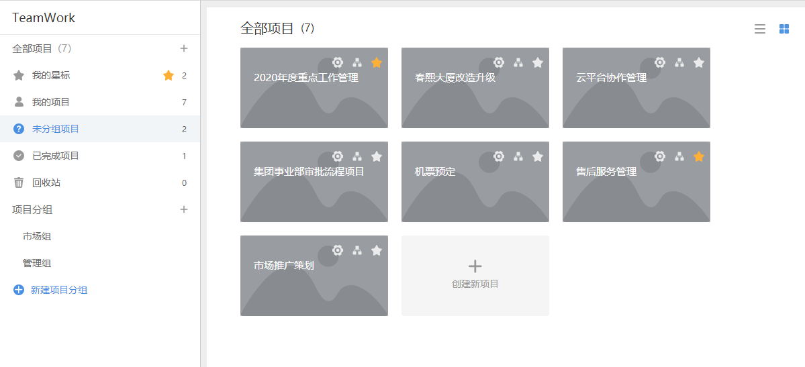
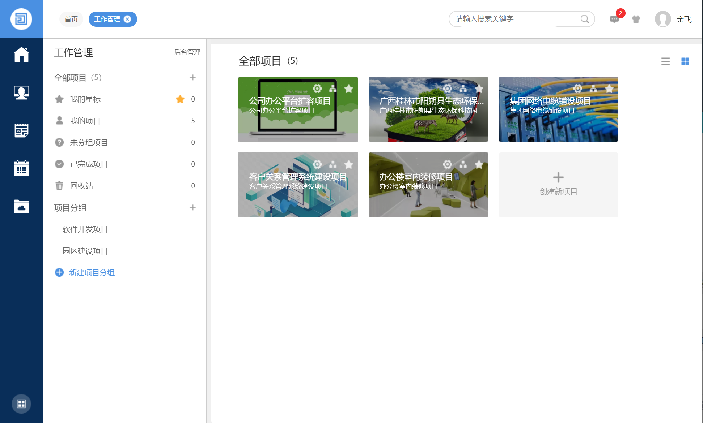
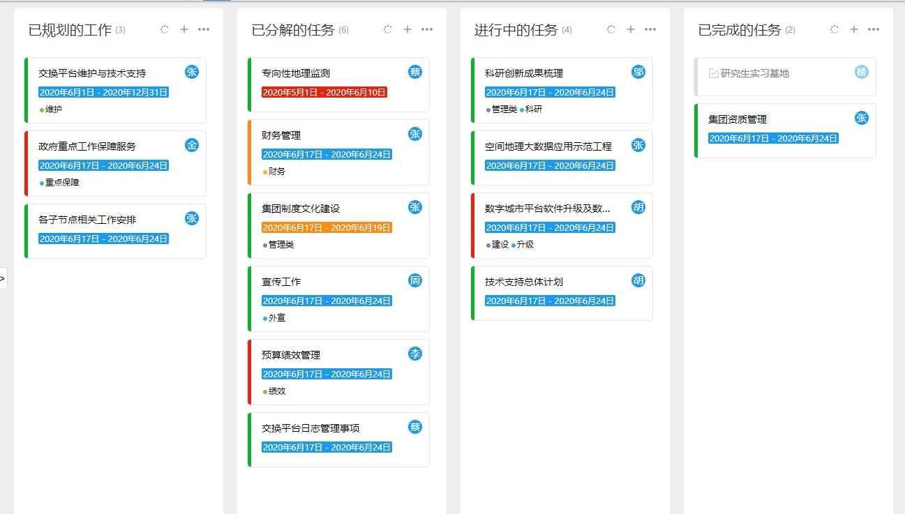
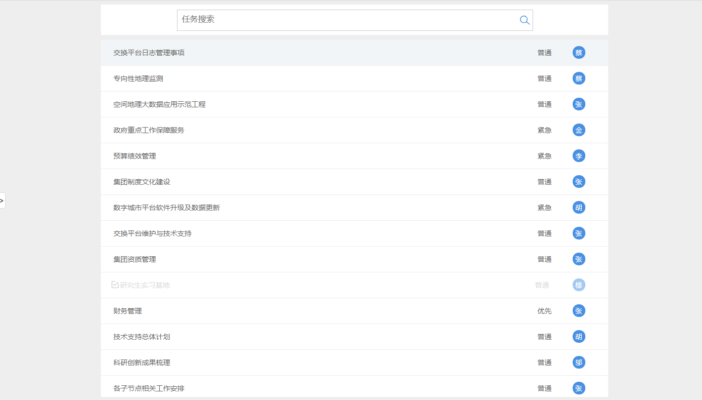
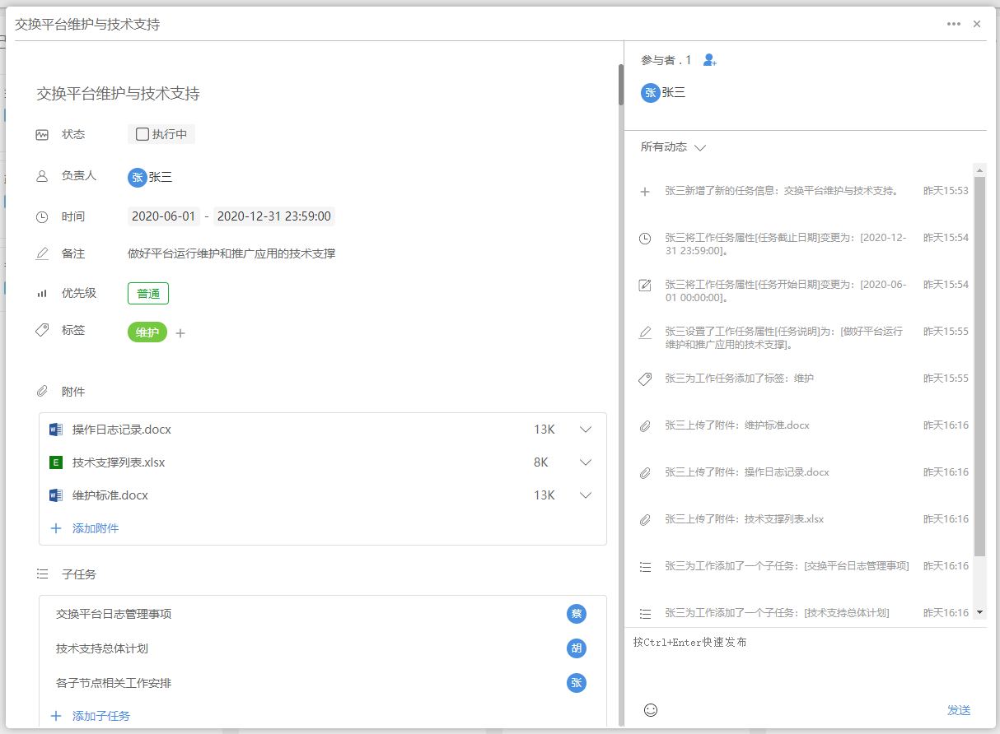

# O2OA-teamwork 

TeamWork 自定义应用。

## 简介

工作管理系统是一套适用于协作型组织及个人，全面实施任务过程化、规范化、信息化的管理软件产品。以扁平化管理思想为理论基础，以任务过程化管理为核心。通过领导者,管理者对日常任务的管理与分配,实现企事业单位的内部协同办公,任务过程追踪和经验知识的积累。

## 特点

- 看板试工作任务管理
- 团队协作更方便
- 自由创建项目任务
- 轻松管理工作项目
- 适用于多行业模板管理1
   
## 项目管理

* #### 项目视图
- 
- 
- 
* #### 看板视图
- 
* #### 列表视图
- 
## 任务管理
- 

